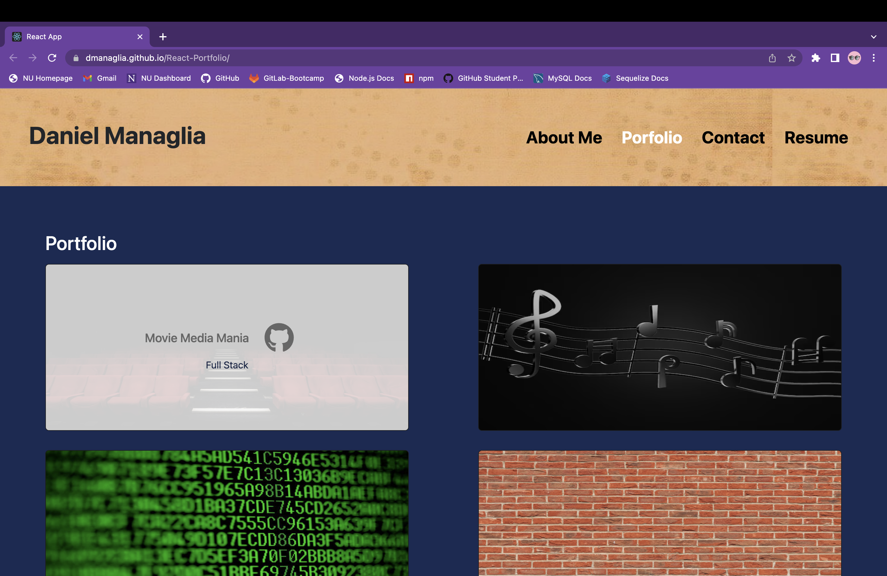
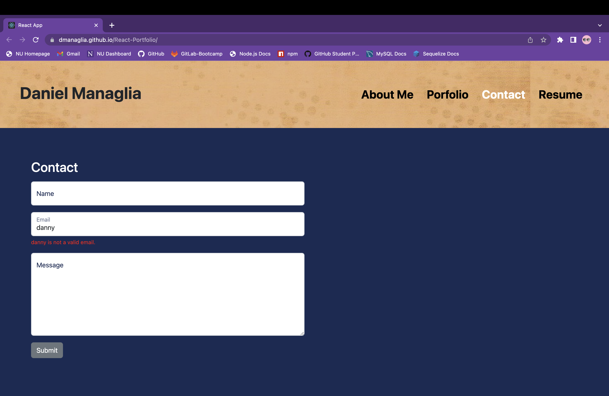

# React-Portfolio
  

  ## Description
  
  I sought to improve my outreach to potential employers by not just giving them a sample of my code or information about myself; instead, I created a webpage that does both! The information on the webpage is all about me, my past projects, a contact request form and a link to my resume. The webpage is built using react and has allowed me to familiarize myself with key concepts such as custom properties and useState. 

  ## Table of Contents
    
  * [Installation](#installation)

  * [Usage](#usage)

  * [License](#license)

  * [Questions](#questions)
  
  ## Installation

  No installation necessary. Click here to view [Live Link](https://dmanaglia.github.io/React-Portfolio/)
  
  ## Usage
  
  The webpage has four main componenents: the about me secion, the portfolio section, the contact section and the resume section. 

  Each project in the portfolio contains a link to the projects live link as well as the projects github repo. 

  

  The contact page has a fully functioning responsive form that requires all requests have a name, email and message, and that the email input is a valid email.
  
  Note: Since this project is front-end only all contact requests are not saved anywhere. The form is merely for visual purposes. 

  

  ## License

  This project is licensed under the MIT license.

  ## Questions

  If you have any questions about the repo, open an issue or contact me directly at ddsmm.managlia@gmail.com. You can find more of my work at [dmanaglia](https://www.github.com/dmanaglia).
  